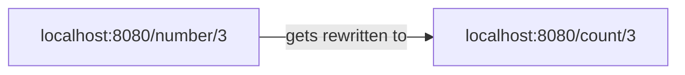

# Introduction to NGINX

> This serves as a simple, basic introduction to NGINX running on your local machine. See [NGINX and Docker](../nginx-and-docker/NOTES.md)

NGINX is an open source piece of software used for reverse proxy, load balancing, and caching for web applications.

## Installation

Installing NGINX is easy, you can just run:

```zsh
brew install nginx
```

This will create an nginx folder at the following directory `/usr/local/etc/nginx`. We can start up nginx by typing `nginx` into our terminal and going to [localhost:8080](http://localhost:8080) where we will be greeted by a welcome page.

## Terminology

In nginx, we have two distinct types. We have blocks of code which can contain key-value pairs:

```nginx
events {
    worker_connections 1024;
}
```

The key-value pairs are known as **directives**, the blocks of code are known as **context**. Within, *context* you can have *directives*.

## Serving Static Content

So, lets image we have our webpage and want to serve static content from a server to the webpage when a customer/client goes on to it.

Lets create a new folder called `my-site` and create a file called `index.html` in it.

```zsh
mkdir my-site

touch my-site/index.html
```

Below is some boilerplate HTML that we want to serve up from our NGINX:

```html
<!DOCTYPE html>
<html>
    <head>
        <meta charset="UTF-8">
        <title>My Site</title>
    </head>
    <body>
        <h1>Hello, world!</h1>
        <p>This is a sample HTML page served by Nginx.</p>
    </body>
</html>
```

Now we need to configure our NGINX to display this HTML when we go to a specific location. We will need to open our `nginx.conf` file to begin our modifications.

> Note: If there is code inside of your `nginx.conf`, just simply remove it. We are going to be starting from scratch

First of all we need to define our contexts. We need both a `http` and an `events` context. This `events` context does not need directives inside of it, it just needs to be in our configuration file. However, inside of the `http` context we are going to define another context (`server`) which will our directives for our nginx server.

```nginx
http{
    server{

    }
}

events{}
```

The first directive we want is the `listen` directive which defines which network port we want our nginx to listen to, in our case `port 8080` so set listen to `listen 8080;`. The directive we want is the `root` directive which sets the filepath containing our files that we want to serve on the webpage. In our case, the root is `root scripts/nginx/my-site;` which contains our HTML file. Finally, we need to ensure that our nginx reloads given our new configuration, in a terminal type:

```zsh
nginx -s reload
```

This new ensures that our NGINX loads the new configruation we have set, and once we go back to [localhost:8080](http://localhost:8080) we should see our `index.html` file instead of the default NGINX welcome.

## Mime Types

So, our HTML site is pretty rubbish. Lets say we want to jazz it up by using some styling and add a `styles.css` file to our `my-site` folder:

```css
h1 {
    background-color: #b85199;
    color: aqua
}
```

Once we link this into our `index.html` we would expect to see our lovely new ***pink*** background applied to our H1 title:

```html
<!DOCTYPE html>
<html>
    <head>
        <meta charset="UTF-8">
        <title>My Site</title>
        <link rel="stylesheet" type="text/css" href="styles.css">
    </head>
    <body>
        <h1>Hello, world!</h1>
        <p>This is a sample HTML page served by Nginx.</p>
    </body>
</html>
```

This is not the case. Our new CSS styling is being served as `Content-Type: text/plain` when we would expect it to be `Content-Type: text/css`. The issue is that currently any file in our root directory will be relayed as `text/plain` when it might not necessarily be that. In our `nginx.conf`, we can define a new context with some type directives to ensure that we correctly load-in the file types we are expecting:

```nginx
http {

    types {
        text/css css;
        text/html html;
    }

    server {
        listen 8080;
        root scripts/nginx/my-site/;
    }

}
```

Here, we are telling NGINX that CSS files are of the type `text/css` instead of the `text/plain` type which ensures that our styling is applied correctly.

> Note: To get the styling to show, you will need to do a **hard** reload of your webpage (Command+Shift+R) instead of a normal reload to avoid returning the previously cached page

Now, whilst defining our types is fine for two types, this types context has the potential to grow and get clogged up with file types that we *may* need to use. Luckily, NGINX already provides these types in a file called `mime.types`. This file contains a bunch of file types that we may want to use already defined for us by NGINX. We can use the `include` directive to use these types in our project:

```nginx
http{
    include mime.types

    server {
        listen 8080;
        root scripts/nginx/my-site;
    }
}

## Location Block

The `location` context allows us to specify endpoints to serve different files. Let's add a new directory to our `my-site` called ***fruits*** with an `index.html`:

```html
<!DOCTYPE html>
<html>
    <head>
        <meta charset="UTF-8">
        <title>My Site</title>
    </head>
    <body>
        <ul>
            <li>Mango</li>
            <li>Banana</li>
            <li>Apple</li>
            <li>Strawberry</li>
        </ul>
    </body>
</html>
```

To serve this new page, we need to use the `location` context. This context is going to live inside of the `server` context we previously defined:

```nginx
    server {
        listen 8080;
        root scripts/nginx/my-site;

        location /fruits {
            root scripts/nginx/my-site;
        }
    }
```

This `location` context takes a second argument which is the endpoint of URL, which in our case is `/fruits`. Inside of this context we then pass the same root as the server context. NGINX will then take the root directory and append the new location onto the root:

*scripts/nginx/my-site --- **+ /fruits** --> scripts/nginx/my-site/fruits*

This ensures that we serve the correct `index.html` for the correct endpoint.

Lets add another folder called `vegetables` but instead of adding an `index.html`, we instead are going to add `vegetables.html`:

```html
<!DOCTYPE html>
<html>
    <head>
        <meta charset="UTF-8">
        <title>My Site</title>
    </head>
    <body>
        <ul>
            <li>Lettuce</li>
            <li>Carrot</li>
            <li>Spinach</li>
            <li>Onion</li>
        </ul>
    </body>
</html>
```

When we add this as a new location we need to do some extra work to ensure that the correct file gets served:

```nginx
    location /fruits {
        root scripts/nginx/my-site;
    }

    location /vegetables {
        root scripts/nginx/my-site;
        try_files /vegetables/vegetables.html /index.html =404;
    }
```

Unlike, the `fruits` folder where we provide an `index.html` we need to help NGINX find the correct file through the addition of the `try_files` directive. This directive essentially says to NGINX, inside of the defined root folder try and find this HTML file, if not then try and return the top level `index.html`, and if all else fails just return a **404 NOT FOUND** error.

We can also add regular expressions to our locations:

```nginx
location ~* /count/[0-9]{
    root scripts/nginx/my-site;
    try_files /index.html =404;
}
```

This new location  ensurs that if we go to `/count` plus a number from 0 to 9 then we will try to return the `index.html`. The addition of `~*` ensures we can use a regular expression.

## Redirects

We can use redirects to redirect traffic from certain endpoints to other ones. For example, lets say we want the endpoint `/crops` to redirect the user to the `/fruits` endpoint. We can use the `return` directive to do this:

```nginx
location /crops {
    return 307 /vegetables;
}
```

Here, the 307 is a redirect status code that takes the user to the `/vegetables` endpoint.

## Rewrites

The above location will take us to a different endpoint, we can use a *rewrite* to ensure our endpoint stays the same but serves content from a different location context. Let's create a rewrite for the endpoint `/number` that rewrites our previously created `/count` endpoint:

```nginx
rewrite ^/number/(\w+) /count/$1;
```

Here we use the `rewrite` directive instead of the `location` context, and say that we want number plus a variable (`\w+`) which rewrites the endpoint to `count/$1` where the `$1` is the variable we define.


