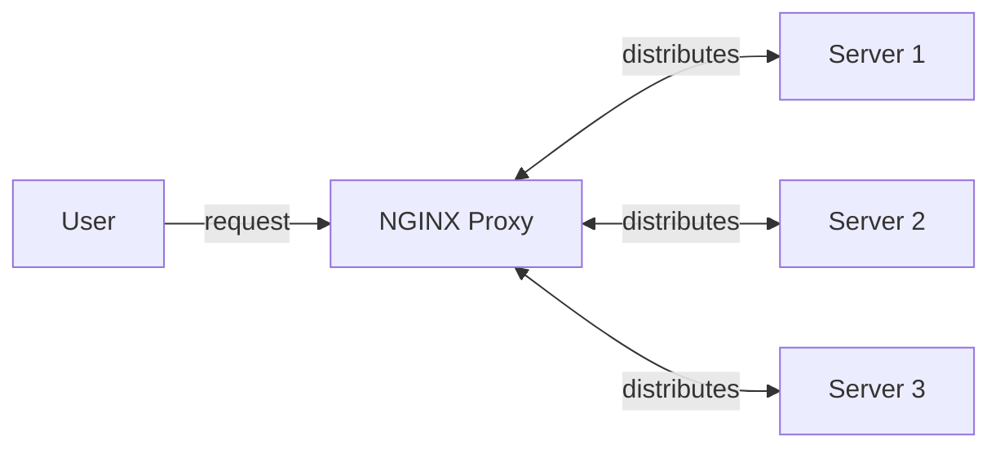
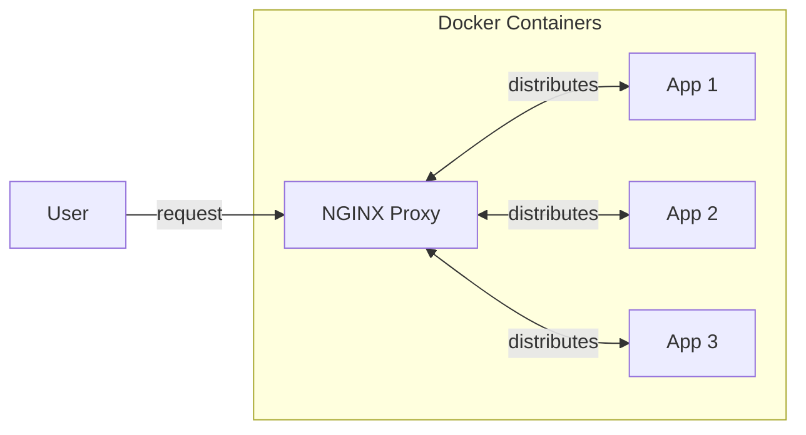
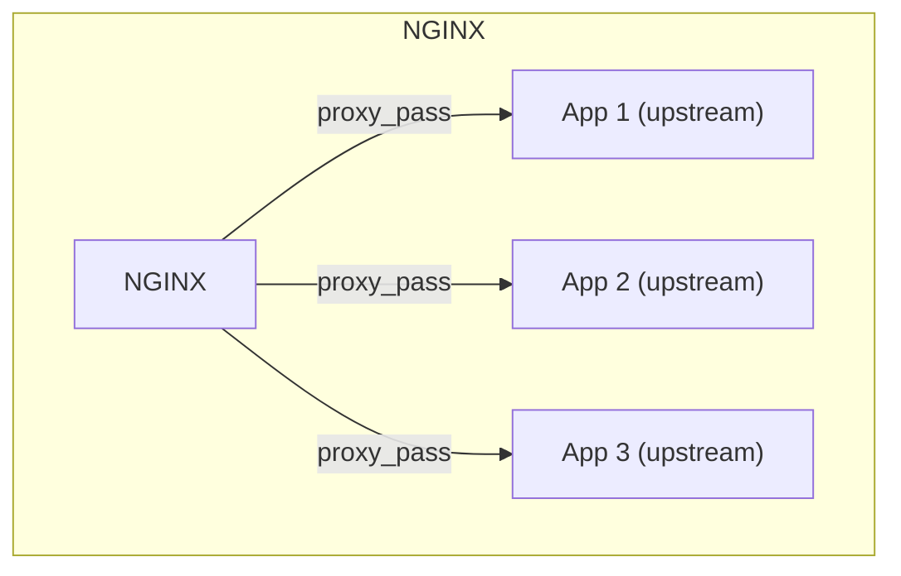

# NGINX and Docker

> This folder covers using NGINX within Docker. For a basic introduction to NGINX running on your local machine, see [Introduction to NGINX](../intro-to-nginx/NOTES.md)

NGINX is not only a web server, it can also be a load balancer and a reverse proxy. The NGINX server proxies requests our webpage and distributes incoming traffic across multiple backend servers which balances the *load* on our site, improves its performance, and also provides redundancy.



There are various methods to distribute the laod across our servers. These include:
* ***Least Connections*** = Routes traffic to the server with the fewest active connections
* ***Round Robin*** = Distributes client requests in a *sequential*, *cyclical manner* to each server in the group

NGINX also provides **caching** where you can cache responses from a backend server for frequently accessed resources. NGINX also provides one entrypoint which reduces the attack surface for potential attacks. With one publically available entrypoint, you can consolidate security, minimise exposure, and centralise access control. Encrypted communication via SSL/TLS can be handled by NGINX ensuring safe communication between the frontend and the backend services enforcing HTTPS.

Previously we explored an NGINX configuration that served static files directly. However, we can also configure NGINX to forward web traffic to other web servers. One of the first things we can do is ensure that we redirect all HTTP requests to HTTPS:

```nginx
server {
    listen 80;
    server_name example.com www.example.com;

    return 301 https://$host$request_url;
}
```

For this project we are going to be using a simple `node.js` web-application. To be able to run our web application, we need `node.js`:

```zsh
# Download and install nvm:
curl -o- https://raw.githubusercontent.com/nvm-sh/nvm/v0.40.5/install.sh | bash

# in lieu of restarting the shell
\. "$HOME/.nvm/nvm.sh"

# Download and install Node.js:
nvm install 26

# Verify the Node.js version:
node -v # Should print "v26.3.1".

# Verify npm version:
npm -v # Should print "11.16.0".
```

Once this is installed, we can then run:

```zsh
npm install
```

Which will install any dependencies we have defined in our `package.json`.

## Dockerising Our Web Application

To start using Docker, we need to create a `Dockerfile` which contains the instructions for how to build our Docker image, defining what goes into this image and how our Docker container should behave when it is running.

```dockerfile
FROM node:17

WORKDIR /app

COPY server.js .
COPY index.html .
COPY images ./images
COPY package.json .

RUN npm install

EXPOSE 3000

CMD["node", "server.js"]
```

Here, we are using a pinned Node image to be able to server our `node.js` web application. We set the working directory inside of the container to be the `/app` directory and then we copy from our local machine all of the files which our web application requires. After copying these files, we then install the required dependencies from our `package.json`, expose the port we want to access the application at and then bring up our application.

To then build this Docker container, we use the `docker build` command:

```zsh
docker build -t myapp:1.0 .
```

Here, we are building an image from our Dockerfile and tagging it with the name `myapp` and a tagged version of `1.0`. We can then run the image as a container via:

```zsh
docker run -p 3000:3000 myapp:1.0
```

> Note: We pass `-p` to explictly bind the port mapping, we use 3000 locally and 3000 within the Docker container.

## From a Dockerfile to a Compose

We can use a docker compose file to simplify the process of defining and running multiple Docker containers within the scope of our application. We can use this compose file to create three instances of our web application which will use NGINX as a load balancer for.

```docker
version: '3'
services:
  app_1:
    build: .
    environment:
      - APP_NAME=App_1
    ports:
      - "3001:3000"

  app_2:
    build: .
    environment:
      - APP_NAME=App_2
    ports:
      - "3002:3000"

  app_3:
    build: .
    environment:
      - APP_NAME=App_3
    ports:
      - "3003:3000"
```

To then start our new applications we run:

```zsh
docker-compose up --build -d
```

We can then check these containers started succesfully by going to [localhost:300 + port number](http://localhost:3001).

## Configure Our NGINX Proxy

We now want to add in our NGINX Proxy to be able to have one publically accessible entrypoint which forwards to our webservers.



We are going to develop our `nginx.conf` to be able to forward traffic to our backend web applications which is going to require some new ***directives*** and ***contexts***.

### Worker Processes and Connections

The directive `worker_processes` controls how many parallel processes NGINX will spawn to handle client requests. Instead of using a new process per each incoming connection, worker processes handle many connections via a signle-threaded event loop.

The number of worker processes directly influences how well our NGINX server can handle traffic (performance) and therefore should be tuned to the hardware of the server (CPU Cores) and its expected traffic load.

The `worker_connections` directive defines how many simultaneous connections can be opened on that worker. If left undefined it defaults to *512*. We implement these directives in the following way within our `nginx.conf`:

```nginx
worker_processes 1;

events {
    worker_connections 1024;
}
```

Within NGINX we have various core contexts that handle different purposes, we have previously seen two of these:

* `events` - General connection processing
* `http` - HTTP traffic
* `mail` - Mail traffic
* `stream` - TCP and UDP traffic

> Note: Any directives placed outside of these contexts are known be in the `main` context

### Upstream

Within our `location` block for our server, we are going to tell NGINX to pass connections from the user to our applications via `proxy_pass` which tells NGINX to 'pass' the request to another server thus making it act as a reverse proxy. The applications that the NGINX forwards to are known as *upstream*. Upstream refers to traffic going from a client toward the source or higher-level infrastructure, for instance an application.



We need to define our upstream as a separate context block within our server context:

```nginx
worker_processes 1;

events {
    worker_connections 1024;
}

http{
    include mime.types;

    upstream nodejs_cluster{
        server 127.0.0.1:3001;
        server 127.0.0.1:3002;
        server 127.0.0.1:3003;
    }

    server{
        listen 8080;
        server_name localhost;

        location / {
            proxy_pass http://nodejs_cluster;
        }
    }
}
```

### Changing Algorithms

As we saw earlier, there are various types of load balancing algorithms. By default, NGINX uses *Round Robin* but we can override this if we know that our upstream servers have different resource allocation. Within the `upstream` block we can pass `least_conn` to use the ***Least Connections*** algorithm.

## Configuring HTTPS

To be able to enable HTTPS, we first need to obtain an SSL/TLS certificate which enables encryption via *public-key* cryptography. When a user connects to a website via HTTPS, the web-server provides its SSL certificate containing a public key which the client uses to establish a secure connection between itself and the server.

We can generate a self-signed certificate which is useful for testing or internal sites, **but is not recommended for production**. To do this we need to create a folder (`certs`), and inside of it we run the following command:

```zsh
openssl req -x509 -nodes -days 365 -newkey rsa:2048 -keyout nginx-selfsigned.key -out nginx-selfsigned.crt
```

This command is made up of the following parts:

* `openssql req` - Initiates the certificate request generation process
* `-x509` - Tells OpenSSL to output a certificate in this certificate format
* `-nodes` - Tells OpenSSL not to encrypt the private key with a passphrase
* `-days 365` - Specifies the validity period of the certificate
* `-newkey rsa:2048` - Creates a 2048-bit RSA key pair
* `-keyout nginx-selfsigned.key` - Specifies the output file for the private key
* `-out nginx-selfsigned.crt` - Specifies the output file for the self-signed certificate containing the public key

### Using SSL Certificates in NGINX

Instead of using port 8080 which is the standard for HTTP, we are going to use port 443 which is the standard for HTTPS:

```nginx
listen 443 ssl;
```

Here, we also pass the `ssl` word which enables secure, encrypted communication but also requires us to pass two more directives:

```nginx
ssl_certificate ./certs/nginx-selfsigned.crt;
ssl_certificate_key ./certs/nginx-selfsigned.key;
```

We pass the location of our public-private pair which we generated via OpenSSL. Now that our HTTPS is working, we can also redirect all of the traffic from the HTTP endpoint to HTTPS:

```nginx
server {
    listen 80;
    server_name localhost;
    return 301 https://$host$request_uri;
}
```

Here, we set our NGINX to listen to port 80, the default for HTTP, and then return a 301 permanent redirect at the requested host and the requested endpoint.

## Dockerising our NGINX

Previously, we explored how we can dockerise our `node.js` application whilst using a local instance of NGINX. We take this one step further and pull NGINX into our Docker stack. To do this, we need to add a new folder to our project:

```zsh
mkdir -p nginx/

cp nginx.conf nginx/nginx.conf
```

Essentially, we are creating a folder to hold our NGINX configuration, and copying across the same NGINX configuration file:

```nginx
worker_processes 1;

events {
    worker_connections 1024;
}

http {

    include mime.types;

    upstream nodejs_cluster {
        least_conn;
        server 127.0.0.1:3001;
        server 127.0.0.1:3002;
        server 127.0.0.1:3003;
    }

    # Redirect HTTP to HTTPS
    server {
        listen 80;
        server_name localhost;
        return 301 https://$host$request_uri;
    }


    server {
        listen 443 ssl;
        server_name localhost;

        ssl_certificate ./certs/nginx-selfsigned.crt;
        ssl_certificate_key ./certs/nginx-selfsigned.key;

        location / {
            proxy_pass http://nodejs_cluster;
            proxy_set_header Host $host;
            proxy_set_header X-Real-IP $remote_addr;
        }
    }
}
```

Then within our `docker-compose.yml`, we need to update our previous web applications and add in the new NGINX container:

```docker
version: '3'
services:
  app_1:
    build: .
    environment:
      - APP_NAME=App_1
    expose:
      - "3000"

  app_2:
    build: .
    environment:
      - APP_NAME=App_2
    expose:
      - "3000"

  app_3:
    build: .
    environment:
      - APP_NAME=App_3
    expose:
      - "3000"

  nginx:
    image: nginx:1.31.0
    container_name: nginx
    restart: on-failure
    ports:
      - "80:80"
      - "443:443"
    volumes:
      - ./nginx/nginx.conf:/etc/nginx/nginx.conf
      - ./certs:/etc/nginx/certs
    depends_on:
      app_1:
        condition: service_started
      app_2:
        condition: service_started
      app_3:
        condition: service_started
```

First of all we remove the explicit port mapping for our web applications to ensure that our NGINX is the singular entrypoint for our application. We then add this new `nginx` container where we pass an image which is publically available ([NGINX](https://hub.docker.com/_/nginx)) and give it a unique name. The `restart: on-failure` ensures that if our NGINX container fails then it is automatically restarted. For this NGINX container we want to ensure that both HTTP and HTTPS ports are mapped and exposed hence both the `80:80` and `443:433` mappings. We also need to copy across our configuration file and our SSL certifications which we add under the volumes mapping the location of these files locally to those on the NGINX container. Finally, we use the `depends_on` field to specifiy the order in which our containers should be started and stopped, we can also pass specific conditions that need to be met by the prior containers before we can start this one.
